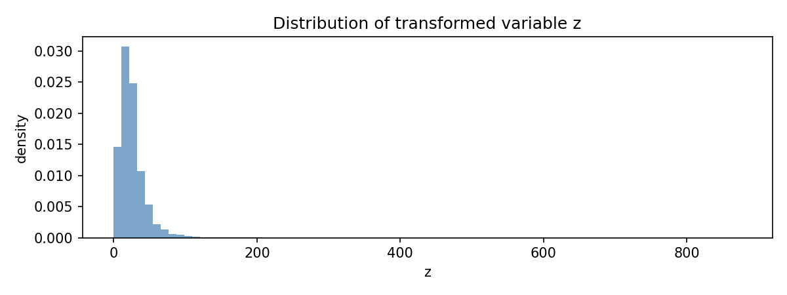
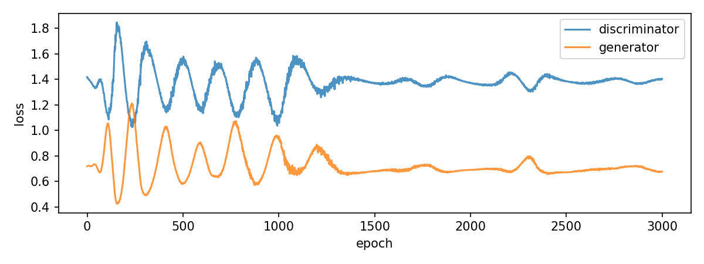
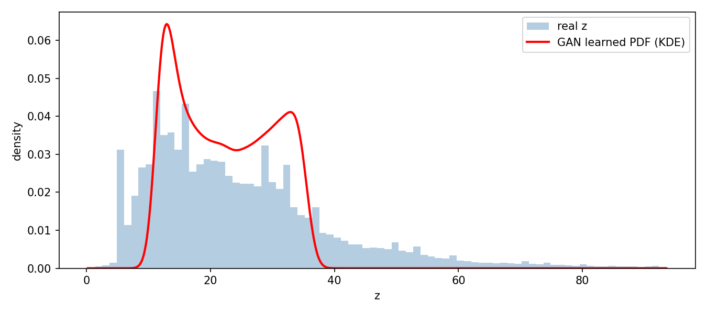

# Assignment - PDF Learning using GAN

Roll Number: 102303230  
a_r = 0.5, b_r = 0.3

## Folder structure

```
learning_pdf/
├── data/
│   └── india_air_quality_data.csv   
├── outputs/                          
├── gan_pdf.ipynb
├── requirements.txt
└── README.md
```

## Steps to run

1. Put `india_air_quality_data.csv` inside the `data/` folder
2. Open `gan_pdf.ipynb` in Jupyter
3. Run all cells top to bottom (Kernel > Restart and Run All)
4. Plots will appear inline and also save to `outputs/`

## Output files

- `outputs/z_distribution.png` - histogram of transformed variable z



- `outputs/training_loss.png` - GAN training curve



- `outputs/gan_pdf.png` - final learned PDF overlaid on real data



## GAN Architecture

Generator: Linear(1,32) -> Tanh -> Linear(32,32) -> Tanh -> Linear(32,1)  
Discriminator: Linear(1,32) -> LeakyReLU -> Linear(32,32) -> LeakyReLU -> Linear(32,1) -> Sigmoid  
Loss: Binary Cross Entropy  
Optimizer: Adam (lr=5e-4)  
Epochs: 3000, Batch size: 256
